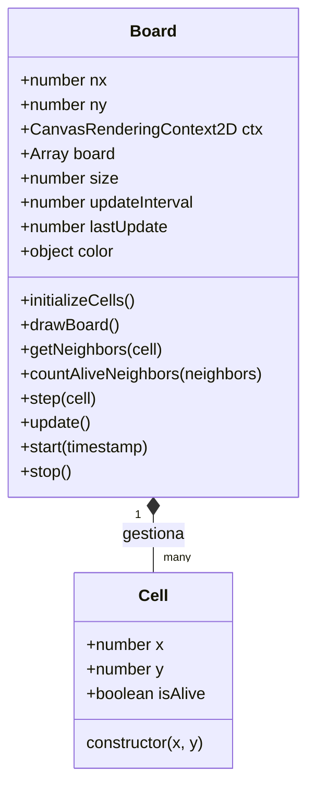

# 🧬 The Game of Life

Una implementación elegante, minimalista e interactiva del famoso autómata celular de John Conway, construida con **JavaScript Vanilla** y **HTML5 Canvas**.

[](https://jaldekoa.github.io/game-of-life/)

---

## 📝 Descripción

El **Juego de la Vida** no es un juego convencional. Es un autómata celular donde no hay jugadores; su evolución depende totalmente de su estado inicial. Este proyecto ofrece una experiencia visualmente limpia y altamente fluida para experimentar con patrones biológicos artificiales.

### Características Principales:
* **Interactividad Total:** Dibuja tus propios patrones directamente sobre el lienzo antes o durante la ejecución.
* **Control de Velocidad:** Ajusta el ritmo de la simulación en tiempo real (desde 2 FPS hasta 60 FPS).
* **Diseño Minimalista:** Interfaz oscura (Dark Mode) centrada en la visibilidad del patrón.
* **Optimización de Ciclo:** Uso de `requestAnimationFrame` con control de *delta time* para un rendimiento estable.

---

## 🕹️ Cómo jugar

1.  **Dibuja:** Haz clic y arrastra sobre el lienzo negro para dar vida a las células.
2.  **Inicia:** Pulsa el botón "Iniciar" para ver cómo evoluciona la colonia.
3.  **Ajusta:** Mueve el slider para acelerar o frenar la evolución según necesites observar los patrones.
4.  **Para:** Detén la simulación en cualquier momento para modificar el estado manualmente.

---

## 🛠️ Tecnologías utilizadas


* **HTML5 Canvas:** Renderizado de alta eficiencia para la rejilla de células.
* **JavaScript (ES6+):** Programación orientada a objetos (OOP) y módulos.
* **CSS3:** Diseño responsivo basado en variables y Flexbox.

---

## 📐 Estructura del Proyecto

El código está organizado siguiendo principios de modularidad para separar la lógica de negocio (las células y el tablero) de la manipulación del DOM.

```text
.
├── index.html          # Estructura principal y controles UI
├── script.js           # Orquestador: Manejo de eventos y conexión DOM-Lógica
├── styles.css          # Estilos modernos y minimalistas
├── README.md           # Documentación
└── src/
    └── Cell.js         # Clases core: Definición de Board y Cell
```

---

## Relación de Clases
La arquitectura se basa en una relación de composición donde el Board gestiona una matriz bidimensional de instancias de Cell.



---

## 🧠 Lógica de Evolución
Para garantizar que el juego funcione correctamente, implementamos un sistema de doble estado. En lugar de modificar las células mientras las leemos (lo que causaría errores en el cálculo de vecinos), el sistema sigue este flujo:

Lectura: Se analiza el tablero actual.

Cálculo: Se genera un mapa de bits con el estado futuro basado en las 3 reglas de Conway (Aislamiento, Supervivencia, Sobrepoblación).

Actualización: Se aplica el mapa de bits a las células reales de una sola vez.

Esto asegura que todas las células "nazcan" o "mueran" simultáneamente en cada turno.

---

## ✒️ Autor
[](https://github.com/Jaldekoa)
[](https://www.linkedin.com/in/jaldekoa/)

"El universo es simplemente un juego de la vida con reglas un poco más complicadas."